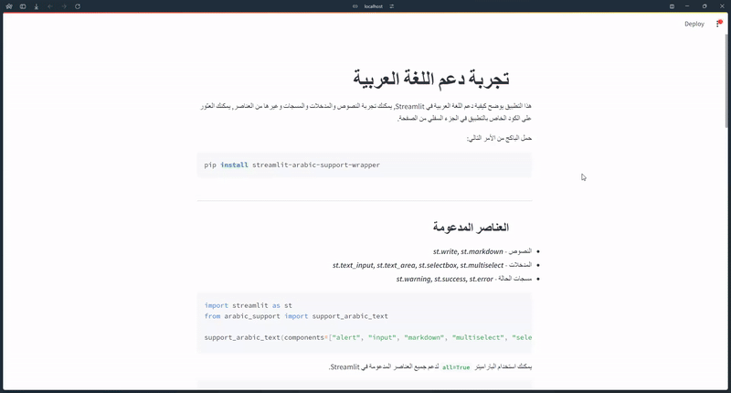

# Streamlit Arabic Support Wrapper

This Python package provides tools to support the alignment and proper display of Arabic text in Streamlit applications. It enhances the visual layout of Arabic content by adjusting the directionality and alignment of text and UI components.

[]

## Features

- **Arabic Text Alignment**: Ensures that Arabic text in Streamlit components such as markdown, input fields, and alerts is correctly aligned from right to left.
- **Support for Multiple Components**: Can apply Arabic text alignment to specific Streamlit components or all supported components at once.
- **Easy Integration**: Easily integrate with existing Streamlit applications to improve the display of Arabic text.

## Installation

You can install the package using pip:

```bash
pip install streamlit-arabic-support-wrapper
```

## Usage
First, import the support_arabic_text function from the package and use it in your Streamlit application. Here's an example of how to use it:

```python
import streamlit as st
from arabic_support import support_arabic_text

# Support Arabic text alignment in all components
support_arabic_text(all=True)

# Application Title
st.title("تجربة دعم اللغة العربية")

# Demonstrating different supported components
st.write("هذا التطبيق يوضح كيفية دعم اللغة العربية في Streamlit.")
```

Or, You can check the following web application for the Package information as example: [Streamlit Arabic Support Wrapper Example App](https://arabic-support.streamlit.app/)

## Supported Components

- **Text displays**: **`st.write`**, **`st.markdown`**
- **Input widgets**: **`st.text_input`**, **`st.text_area`**, **`st.selectbox`**, **`st.multiselect`**
- **Alerts**: **`st.warning`**, **`st.success`**, **`st.error`**


You can enable support for specific components by passing a list of component names to **`support_arabic_text`**, or use **`all=True`** to support all available components.

## Example
Here's a code snippet to support specific components:

```python
import streamlit as st
from arabic_support import support_arabic_text

support_arabic_text(components=["input", "selectbox", "alert"])
```
This will apply Arabic text alignment to input fields, select boxes, and alert messages.

## Author

**Basel Husam**

Feel free to contact me at baselmathar@gmail.com.


## License
This project is licensed under the Apache License 2.0 - see the LICENSE file for details.

## Contributions
Contributions are welcome! Please create an issue or pull request on GitHub if you have suggestions or contributions.
